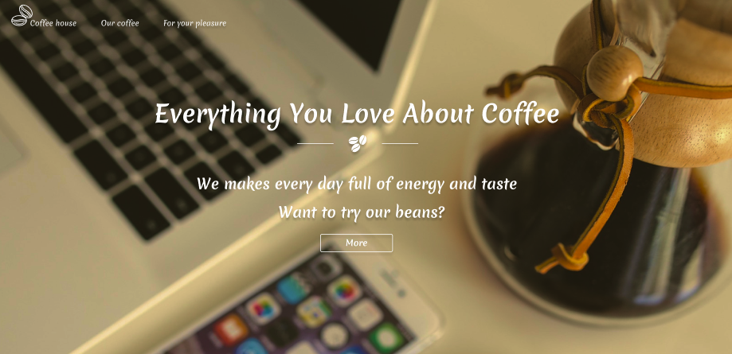

# CoffeeShop
## About

Practical task at the end of the module:
["The Complete JavaScript + React Course"](https://www.udemy.com/share/101WCC3@4_CWIYmpbQ5JBo-Ti3eKe4hT9cCUuWey0HtFpYfJPFUcQRfXsTkIVgsNPp-Ssn7Q3Q==/)

## Technology used:
- Redux Toolkit 
- React Router
- React Hooks 
- Bootstrap
- CSS-Modules / SCSS 

>### If you want to see the :
>- [Template](https://www.figma.com/file/Iu4Lul87WvzdM5CXFwE4qtZ6/Coffee-shop?node-id=0%3A1&t=6azX4JyP11ZMPbsy-0)
>- [Deploy](https://coffee-shop-ochre.vercel.app/)

